# Kubernetes

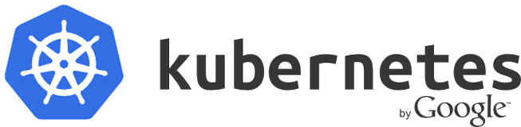

El nombre de **Kubernetes** procede del Griego, significa timonel o piloto y es la raiz del gobernador y cibernético. Podras encontrar la abrebiación de kubernetes como **K8s** deribado de la sustitución del 8 por las letras "ubernete".

Proyecto opensource de Google que comenzó en 2014, (actualmente se encuentra en el top 5), diseñado para automatizar el despliegue, escalado y poder operar con aplicaciones contenerizadas. En definitiva es un orquestador de contenedores. El proyecto interno de Google se llamaba **Borg** (más de 10 años usandolo), y su evolución fue Kubernetes.

Actualmente Dockers ha anunciado que va a dar soporte a Kubernetes, ya que es la herramienta de orquestación de contenedores docker mas usada y con mas apoyo en la comunidad.

**Kubernetes es:**

- Portable: Puede correr en multiples clouds (privadas y públicas) y en baremetal.
- Extensible: Modulable, hookable, pluggable..
- Self-healing: auto-restart, auto-replication, auto-scaling...

Nos proporciona todo lo necesario para mantener en producción nuestros framework:

- Montaje de volumenes para su persistencia (Soporta multiples soluciones).
- Distribución de secretos y gestor de la configuración.
- Gestión de la vida del contenedor.
- Replicación de contenedores.
- Uso de autoscalado horizontal.
- Service Discovery y balanceo de tus framework.
- Monitorización.
- Acceso a los logs y debug de tus framework.

**Kubernetes NO es lo siguiente...**

- No realiza el CI de tu framework, para ello puedes Utilizar Fabric8, El cual está preparado para correr sobre kubernetes.
- No dispone de un marketplace para despliegue de servicios (Pero si hay herramientas que lo complemetan como helm)

**Otras alternativas a Kubernetes**

- Nomad (Hasicorp)
- Marathon (Mesos)
- Docker Swarm

**Colaboradores del proyecto**

- Linux Fundation
- Canonical
- CoreOs
- Cisco
- Docker
- Google CLoud
- Redhat
- Huawei
- Ibm
- Mirantis
- Microsoft
- Oracle
- Rancher
- Suse
- Vmware
- Ebay
- Bla Bla Car
- Philips
- Samsung
- SAP
- Yahoo!

**Arquitectura a Alto Nivel**
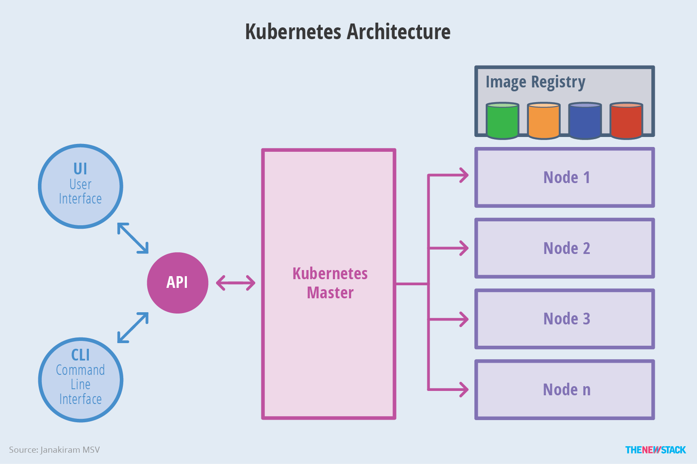

# Conceptos Básicos

Antes de comenzar, tenemos que tener una seríe de conceptos básicos:

- **Cluster:** Conjunto de másquinas físicas o virtuales y otros recursos utilizados por kubernetes.
- **Nodo:** Una máquina física o virtual ejecutándose en kubernetes donde pods pueden ser programados.
- **Pod:** Conjunto de contenedores y volumenes. Son la unidad más pequeña desplegable.
- **Deployment o ReplicaSet: (Controllers)** Gestor de Pods que asegura que están levantadas las réplicas y permite escalar de forma fácil. Una réplica es una copia exacta de un Pod. Levanta Pods en caso de fallos o reinicios. Lo bueno del Deployment te permite actualizar de una forma mas controlada tu aplicación.
- **Services:** Define como acceder a un grupo de Pods.
- **Namespaces:**  Establece un nivel adicional de separación entre los contenedores que comparten los recursos de un clúster.
- **Configmap:** Servicio para gestionar la configuración de nuestras aplicaciones (Una buena práctica es separar el código de nuestra aplicación de la configuración).
- **Secrects:** Servicio para gestionar los secretos de nuestras aplicaciones.
- **Volumes:** Servicio para gestionar la persistencia de los contenedores.

Toda la información la puedes encontrar en el siguiente enlace oficial:  
<https://kubernetes.io/docs/concepts/>

# Componentes del Cluster

  - **Master Components**
    - **kube-apiserver:** Expone la API de Kubernetes, es el front-end de control. Está diseñado para escalar horizontalmente.
    - **etcd:** Se usa como respaldo de Kubernetes, todos los datos del cluster se almacenan aquí, manteniendolos en alta disponibilidad. La parte más importante es el sistema de almacenamiento sobre el que toda la información de Kubernetes se asienta. Sí el data persiste cualquier error, es posible reconstruir el cluster. En cambio sí se pierda la información, hay que reconstruir el cluster de nuevo. El uso de una base de datos clave-valor distribuida como etcd, te permite replicar la información en todas tus instancias. Esto significa que perder la información almacenada en todas tus tres instancias lo cual pasaría sí los discos fallan al mismo tiempo. La probabilidad de que esto ocurre es bastante baja, además esta es la solución escogida por muchos expertos. Para ser aún más tolerante a fallos una opción es ampliar el número de instancias en las que se almacena la información.
    - **kube-controller-manager:** Ejecuta los controladores, se encarga de las rutinas del cluster.
    - **cloud-controller-manager:** Se encarga de interecturar con los proveedores de la nube (Funcionalidad en alpha introducida en la versión 1.6)
    - **kube-scheduler:** Se encarga de mirar los pods creados recientemente y si no tienen asignado un nodo este los asigna.
    - **addons:** Son pods y servicios que implementan funcionalidades al cluster.
    - **DNS:**Cluster DNS es un servidor de DNS, además sirve de registro DNS para los servicios de Kubernetes. Los contenedores iniciados en kubernetes serán añadidos al DNS automáticamente.
    - **Web UI (Dashboard):** Es el Dashboard de Kubernetes.Permite administraro y solucionar problemas en las aplicaciones que se ejecutan en el clúster, así como en el propio clúster.
    - **Container Resource Monitoring:** Graba una serie de metricas sobre los contenedores y nos la facilita por el WEB UI.
    - **Cluster-level Logging:** Es el responsable de salvar los logs de los contenedores a un registro central para posteriormente poderse buscar desde una interfaz web.

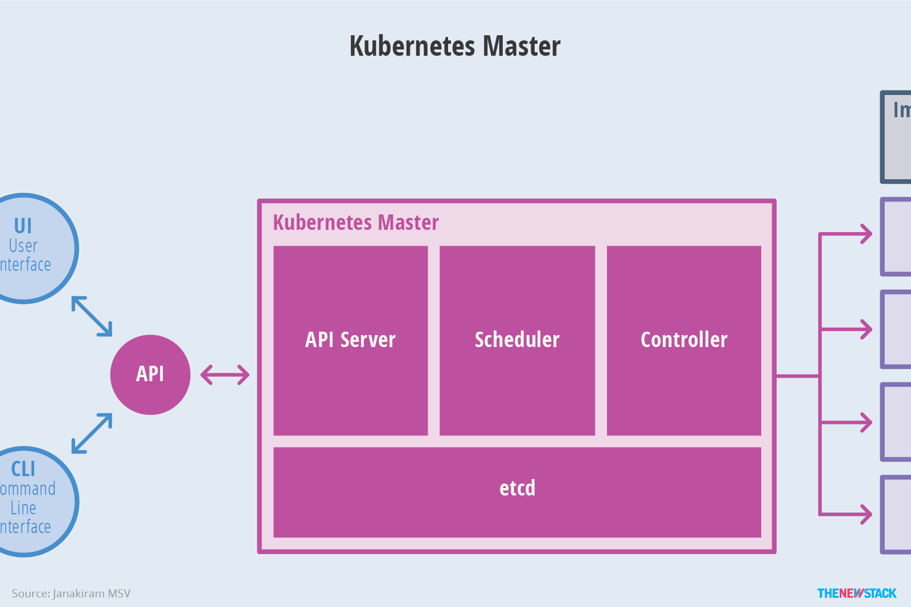

------------------------------------

  - **Node components**(Mantiene corriendo los pods y proporciona el entorno de tiempo de ejecución de Kubernetes).
    - **kubelet:** Es el agente de nodo primario. Busca los pods que se le han asignado a su nodo.
        - Monta los volúmenes requeridos para los pod’s.
        - Descarga los secretos de los pod's.
        - Corre los pod's via docker (o exprimentalmente, rkt).
        - Periodicamente ejecuta el liveness probes, para comprobar el estado del contenedor.
        - Reporta el estado del pod a todo el sistema, para crear un pod espejo si es necesario.
        - Reporta el estado del nodo a todo el sistema.
    - **kube-proxy:** Permite la abstracción del servicio de Kubernetes manteniendo las reglas de red en el host y realizando el reenvío de la conexión.
    - **docker:** Es usado para correr los contenedores.
    - **rkt:** Está soportado de manera experimental para correr contenedores como alternativa a docker.
    - **supervisord:** es un sistema de control y monitor de proceso liviano que se puede usar para mantener funcionando el kubelet y los contenedores docker.
    - **fluentd:** es un demonio que ayuda a proporcionar los logs a nivel de clúster.

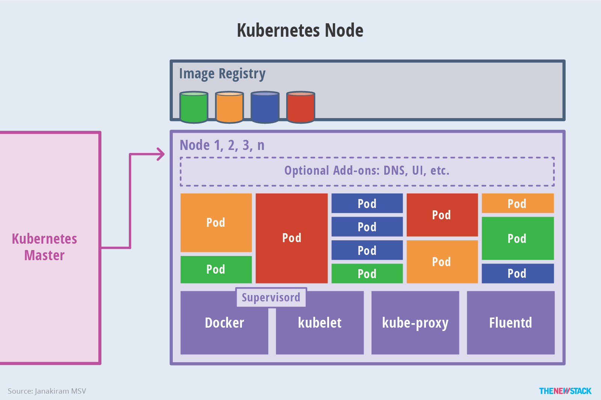

# Tutoriales Interactivos de K8s

 - Tutorial Online oficial: En el siguiente enlace podréis realizar un curso interactivo para correr un minikube en vuestro equipo y aplicaciones para vuestras pruebas y aprender los conceptos básicos.
[Tutorial de Kubernetes Interactivo][11]
- Katakoda Cuso: <https://www.katacoda.com/courses/kubernetes>

# Juega con K8s

Tenemos varias opciones para jugar con Kubernetes:

- **Minikube** es el método recomendado para crear un clúster de Kubernetes local de un solo nodo para desarrollo y pruebas. La configuración es completamente automática y no requiere una cuenta de proveedor de la nube. En el siguiente enlace podrás habilitar una VPN access a traves de telepresence. <https://www.telepresence.io/tutorials/minikube-vpn.html>
- **Kubeadm-dind** es un clúster Kubernetes multinodo (mientras que minikube es de un solo nodo) que solo requiere un daemon docker. Utiliza la técnica de docker in docker para generar el clúster de Kubernetes.
- **PWK** El sitio PWK (<http://play-with-k8s.com/>) permite montar clústers de Kubernetes y lanzar servicios replicados de manera rápida y sencilla. Se trata de un entorno donde realizar pruebas y jugar durante cuatro horas con varias instancias de Docker sobre las que podemos usar kubeadm para instalar y configurar Kubernetes, creando un clúster en menos de un minuto. 
- **Kubespray** Para poder instalar en multiples entornos, realizado con Ansible.

Nosotros para nuestras pruebas usaremos [**Kubeadm-dind - Enlace**][12], para levantar un cluster en local compuesto por un master y dos nodos.

    cd ~
    wget https://cdn.rawgit.com/Mirantis/kubeadm-dind-cluster/master/fixed/dind-cluster-v1.8.sh
    chmod +x dind-cluster-v1.8.sh
    ./dind-cluster-v1.8.sh up  
    export PATH="$HOME/.kubeadm-dind-cluster:$PATH"

    kubectl get nodes
    NAME          STATUS    AGE       VERSION
    kube-master   Ready     6m        v1.8.1
    kube-node-1   Ready     5m        v1.8.1
    kube-node-2   Ready     5m        v1.8.1

**Podremos visualizar nuestro dashboard en:**  
<http://localhost:8080/ui>

# Despliegue de una aplicación con Helm

**Prodremos desplegar tambien aplicaciones muy facilmente con el comando helm, te facilita la instalación de un stack, seguido veremos un ejemplo.**

Requisitos:
Instalación de Helm

1. Init Helm
    Helm init
**Enlaces de Interés:**
- <https://helm.sh>
- <https://docs.helm.sh/using_helm/#quickstart-guide>

# POD's

**Este pod es un grupo de uno o más contenedores** (normalmente de Docker, también preparado para otras tecnologías de contenerización).

Varios contenedores que pertenezcan al mismo pod son visibles unos de otros vía localhost. Los contenedores que se encuentran en distintos pods no pueden comunicarse de esta manera.

Hay que tener en cuenta que los pods son entidades efímeras. En el ciclo de vida de un pod estos se crean y se destruyen, si un nodo que contiene un pod es eliminado, todos los pods que contenía ese nodo se pierden y serán remplazados en otro nodo. Esto es importante porque un pod no debería de tener información almacenada que pueda ser utilizada después por otro pod en caso de que a este le pasara algo. Para compartir información entre pods están los volúmenes de persistencia (Hablaremos de ello en otro instante).

La comunicación entre pods por ejemplo se podrá usar "Flannel", el cual va a generar en cada uno de los nodos uns subnet y luego configurará docker para que forme parte de esa subnet.
¿Como se comunica flannel con el resto de nodos? Flannel consulta a ectd cual es la configuración de la red del cluster, con esto ya puede entender a que nodos tiene que enviar las peticiciones.

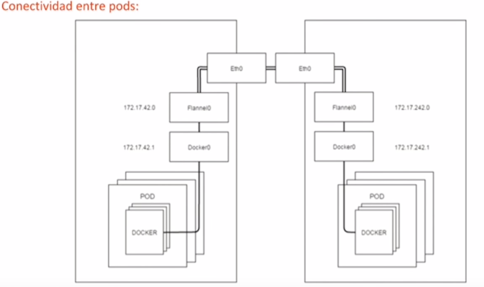

 **Los pods pueden utilizarse para realizar escalado horizontal**, aunque fomentan el trabajo con microservicios puestos en contenedores diferentes para crear un sistema distribuido mucho más robusto. Puedes encontrar más información sobre los patrones utilizados aquí.

**Ejemplo de Pod:**

    apiVersion: v1
    # Tipo de fichero que se va a crear.
    kind: Pod
    # Aquí van los datos propios del pod como el nombre y los labels que tiene asociados para seleccionarlo
    metadata:
        name: nginx-ecommerce
        # Especificamos que el pod tenga un label con clave "app" y valor "nginx"
        labels:
            app: nginx-ecommerce
    # Contiene la especificación del pod
    spec:
        # Aquí se nombran los contenedores que forman parte de este pod. Todos estos contenedores serían visibles por localhost
        containers:
            - name: nginx
            image: nginx:1.13.6
            ports:
                - containerPort: 80
        # Aquí se define la política de restauració en caso de que el pod se detenga o deje de ejecutarse debido a un fallo interno.
        restartPolicy: Always

# Controllers

Deployment es uno de los "Controllers" de Kubernetes, estos son todos los disponibles:

  - **Controllers**  
    - [Replication Controller][2]
    - [Replica Sets][1] (Es la evolución del Replication Controller).
    - [Deployments][3] (La única diferencia entre este y el ReplicaSet ahora mismo es el selector support).
    - [StatefulSets][4]
    - [Daemon Sets][5]
    - [Garbage Collection][6]
    - [Jobs - Run to Completion][7]
    - [Cron Jobs][8]

Un Deployment se asegura de que grupo de uno o más pods esté siempre disponible. Siempre que queramos desplegar un contenedor es muy recomendable usarlo para gestionar la vida del contenedor. Un Deployment es al fin y al cabo un supervisor de un grupo de uno o más pods a través de un conjunto de nodos. La diferencia con un Replica Set es a la hora de actualizar nuestra aplicación lo realiza de una forma mas eficiente, si tenemos una aplicacion corriendo en 3 pod's y la actualizasemos se haría de una forma ordenada para no perder servicio.

**Ejemplo de un Deployment:**

    # Número de versión del api que se quiere utilizar
    apiVersion: apps/v1beta2 # for versions before 1.8.0 use apps/v1beta1
    kind: Deployment # Tipo de fichero.
    metadata:
    # Nombre del Replication Controller
    name: nginx-ecommerce
    namespace: development
    labels:
        app: nginx-ecommerce
    spec: # La especificación del estado deseado que queremos que tenga el pod.
    replicas: 3 # Número de réplicas que queremos que se encargue de mantener el rc. (Esto creará un pod)
    selector: # En esta propiedad se indican todos los pods que se va a encargar de gestionar este replication controller. En este caso, se va a encargar de todos los que tengan el valor "nginx" en el label "app"
        matchLabels:
        app: nginx-ecommerce
    template:
        metadata:
        labels:
            app: nginx-ecommerce
        namespace: development
        spec:
        containers:
        - name: nginx
            image: nginx:latest
            ports:
            - containerPort: 80
            env:
            - name: VARIABLE_CERT1
            value: "/keys/domain1.key"
            - name: VARIABLE_CERT2
            value: "/keys/domain2.key"
            readinessProbe: # Comprueba que la aplicación haya corrido al completo antes de balancear carga en ella
            httpGet:
                path:
                port: 80
            initialDelaySeconds: 30 # Number of seconds after the container has started before liveness probes are initiated.
            failureThreshold: 3 # When a Pod starts and the probe fails, Kubernetes will try failureThreshold times before giving up and restarting the Pod. Defaults to 3. Minimum value is 1.
            timeoutSeconds: 10 # Number of seconds after which the probe times out. Defaults to 1 second. Minimum value is 1.
            livenessProbe: # Comprueba que la aplicación este funcionando correctamente sino mata el contenedor y lo vuelve a arrancar.
            httpGet:
                path:
                port: 80
            initialDelaySeconds: 30
            failureThreshold: 3
            timeoutSeconds: 10
            resources:
            requests:
                memory: "128Mi"
                cpu: "100m"
            limits:
                memory: "256Mi"
                cpu: "200m"
            volumeMounts:
            - mountPath: /etc/cert
            name: certificates
        volumes:
        - name: certificates
            hostPath:
            # Directorio del hosts/nodo, está es una mala practica ya que se monta desde un nodo, si el pod se encontrase en otro nodo no recogerías correctamente la persistendia y se se callese el nodo que guarda los datos se perdería del todo.
            path: /home
            type: Directory

Para re-escalar una aplicación:

    kubectl scale deployment nginx-ecommerce --replicas=2

# Services

Como hemos comentado anteriormente los pods son volátiles (Se crean y se destruyen, el encargado de ello es el Deployment que hayamos definido).

Cada pod tiene su propia dirección IP (que podría incluso no ser constante en el mismo pod a lo largo del tiempo). Esto nos supone un problema en caso de que un pod necesite comunicarse con otro pod. ¿Qué manera tienen de comunicarse ambos, si las ip de cada pod son variables, o si uno de los dos se cae y lo sustituye otro? De esto justo se encargan los services.

Un service es una abstracción que define un grupo lógico de pods y una política de acceso a los mismos. Los pods apuntan a un servicio normalmente por la propiedad label. Pongamos como ejemplo nuestro caso anterior, dónde tenemos un replication controller encargado de ejecutar un pod con un contenedor nginx. Si algo causara la destrucción de este pod, el replication controller crearía uno nuevo con una ip diferente, de forma que el resto de la infraestructura que dependiera de ese pod por esa ip fija dejaría de funcionar. El servicio lo que hace es que ese pod siempre sea accesible de la misma manera, de forma que aunque el pod se destruya o se modifique siempre sea accesible por la abstracción. A continuación crearemos un servicio y también comprobaremos como podemos exponerlo desde fuera del cluster, con el atributo NodePort (que lo que hace es exponer el servicio en cada nodo del cluster de forma que serás capaz de contactar con el servicio desde cualquier ip de los nodos).

**Accediendo a nuestra aplicación**

Tenemos tres "ServiceType:" para acceder a nuestra aplicación:

**1. ClusterIP:** usa únicamente IP interna del Cluster. **Podremos acceder a través de una VPN o desde dentro del cluster (nodo o contenedor)**

**2. NodePort:** Todos los nodos del cluster van a exponer el puerto del servicio a través del servicio kube-proxy que también se encuentra en todos los nodos. On top of having a cluster-internal IP, expose the service on a port on each node of the cluster (the same port on each node). You’ll be able to contact the service on any :NodePort address.

As you can see, there’s no WildFly Kubernetes Service defined, that’s why we need many steps to get the IP address of the POD running WildFly. If we kill the POD, the IP address will change. So, for frontend services like WildFly, it’s recommended to create a Kubernetes Service and access the application through it.

The only single difference is that we want now to access this POD from outside our cluster. We will now explore how to do it using the NodePort. First we need to define the following Kubernetes Service file:

    apiVersion: v1
    kind: Service
    metadata: 
    name: wildfly-service
    labels:
        name: wildfly
        context: docker-k8s-lab
    spec: 
    type: NodePort
    ports:
        # the port that this service should serve on
        - port: 8080
    # label keys and values that must match in order to receive traffic for this service
    selector: 
        name: wildfly
        context: docker-k8s-lab

Now, Kubernetes master will allocate a port (default: 30000-32767), and each Node will proxy that port (the same port number on every Node) into the WildFly POD.

    kubectl create -f <path to wildfly service file>

You have exposed your service on an external port on all nodes in your
cluster.  If you want to expose this service to the external internet, you may
need to set up firewall rules for the service port(s) (tcp:30140) to serve traffic.

See http://releases.k8s.io/HEAD/docs/user-guide/services-firewalls.md for more details.
services/wildfly-service
Finally you can now use the combination between the node ip and the service port to access the service.

Get the Node IP:

    kubectl get nodes

    NAME         LABELS                              STATUS
    10.245.1.3   kubernetes.io/hostname=10.245.1.3   Ready

Get the PORT of the service:

    kubectl describe se wildfly-service
    
    Name:               wildfly-service
    Namespace:          default
    Labels:             context=docker-k8s-lab,name=wildfly
    Selector:           context=docker-k8s-lab,name=wildfly
    Type:               NodePort
    IP:                 10.247.39.239
    Port:               <unnamed> 8080/TCP
    NodePort:           <unnamed> 30140/TCP
    Endpoints:          10.246.88.7:8080
    Session Affinity:   None
    No events.

Finally Access the application from outside the cluster:

open your browser at <http://10.245.1.3:30140/employees/>

**3. LoadBalancer:** on top of having a cluster-internal IP and exposing service on a NodePort also, ask the cloud provider for a load balancer which forwards to the Service exposed as a :NodePort for each Node.
As you can see in mysql-service this field was not specifed, which means that the MySql is accessible only inside the cluster. But if you want to access WildFly you may need to be inside on of Kubernetes node.

The other ways (LoadBalancer and Openshift)

You can define ServiceType=LoadBalancer. But that works only for cloud provider which support external load balancers. There’s a work in progress project at https://github.com/kubernetes/contrib/tree/master/service-loadbalancer that is self-defined as “how to set up a bank of haproxy for platforms that don’t have load balancers”.

**Exponer nuestro servicio al exterior con Ingress**

     internet
        |
    [ Ingress ]
    --|-----|--
    [ Services ]

**Single Service Ingress**

    apiVersion: extensions/v1beta1
    kind: Ingress
    metadata:
    name: test-ingress
    spec:
    backend:
        serviceName: testsvc
        servicePort: 80

**Name based virtual hosting**

    foo.bar.com --|                 |-> foo.bar.com s1:80
                | 178.91.123.132  |
    bar.foo.com --|                 |-> bar.foo.com s2:80

Estructura de un ingress basado en virtual hosting:

    apiVersion: extensions/v1beta1
    kind: Ingress
    metadata:
    name: test
    spec:
    rules:
    - host: foo.bar.com
        http:
        paths:
        - backend:
            serviceName: s1
            servicePort: 80
    - host: bar.foo.com
        http:
        paths:
        - backend:
            serviceName: s2
            servicePort: 80

# Namespaces

Los namespaces (espacios de nombres) en Kubernetes permiten establecer un nivel adicional de separación entre los contenedores que comparten los recursos de un clúster.

Esto es especialmente útil cuando diferentes grupos usan el mismo clúster y existe el riesgo potencial de colisión de nombres de los pods, etc usados por los diferentes equipos.

Los espacios de nombres también facilitan la creación de cuotas para limitar los recursos disponibles para cada namespace. Puedes considerar los espacios de nombres como clústers virtuales sobre el clúster físico de Kubernetes. De esta forma, proporcionan separación lógica entre los entornos de diferentes equipos.

Kubernetes proporciona dos namespaces por defecto: kube-system y default. A grosso modo, los objetos “de usuario” se crean en el namespaces default, mientras que los de “sistema” se encuentran en kube-system.

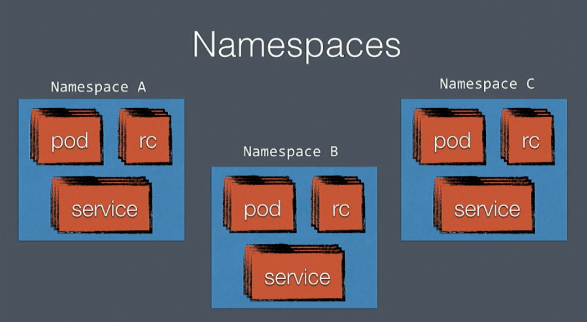

Para ver los espacios de nombres en el clúster, ejecuta:

    kubectl get namespaces
    NAME          STATUS    AGE
    default       Active    21d
    kube-system   Active    21d
    Puedes obtener el mismo resultado usando ns en vez de namespaces

**Crea un nuevo Namespaces**

Para crear un namespace, crea un fichero YAML como el siguiente:

    kind: Namespace
    apiVersion: v1
    metadata:
      name: development
      labels:
        name: development

Para crear el namespace, ejecuta:

    kubectl create -f ns-developers.yaml
    namespace "developers" created

Al obtener la lista de espacios de nombres disponibles, observa que ahora el nuevo namespace aparece:

    kubectl get ns
        NAME          STATUS    AGE
        default       Active    21d
        developers    Active    55s
        kube-system   Active    21d

Observa con detalle el namespace creado:

    kubectl describe ns developers
        Name:    developers
        Labels:     <none>
        Annotations:   <none>
        Status:     Active

        No resource quota.

        No resource limits.

Idealmente, el particionamiento del clúster en espacios de nombres permite repartir los recursos del clúster imponiendo cuotas, de manera que los objetos de un determinado namespace no acaparen todos los recursos disponibles.

A continuación indico cómo establecer algunos límites para el namespace (basado en Apply Resource Quotas and Limits).

**Aplicando quotas al número de objetos en el Namespace**

Para aplicar una cuota, creamos un fichero YAML del tipo ResourceQuota:

    apiVersion: v1
    kind: ResourceQuota
    metadata:
    name: object-counts
    spec:
    hard:
        persistentvolumeclaims: "2"
        services.loadbalancers: "2"
        services.nodeports: "0"

Esta cuota limita el número de:

    volúmenes persistentes (2)
    balanceadores de carga (2)
    node ports (0)

Para crear la cuota, aplica el fichero YAML.

Debes especificar el namespace donde aplicar la cuota.

    kubectl create -f quota-object-counts.yaml --namespace developers
    resourcequota "object-counts" created
    Comprobamos que se ha aplicado la cuota al namespace developers:

    kubectl describe ns developers
    Name:    developers
    Labels:     <none>
    Annotations:   <none>
    Status:     Active

    Resource Quotas
    Name:         object-counts
    Resource      Used  Hard
    --------      ---   ---
    persistentvolumeclaims 0  2
    services.loadbalancers 0  2
    services.nodeports  0  0

    No resource limits.

Esta cuota impide la creación de más objetos de cada tipo de los especificados en la cuota (es decir, como máximo, puede haber dos load balancers en el namespaces developers).

**Aplicando cuotas a los recursos del Namespace**

Habitualmente los límites que se suelen establecer para cada namespaces están enfocados a limitar los recursos de CPU y memoria del namespace.

El siguiente fichero YAML especifica un límite de 2 CPUs y 2GB de memoria. Además, especifica una limitación en cuanto a las peticiones que debe realizar un pod en este namespaces. Finalmente, también se establece una limitación de como máximo, 4 pods.

    apiVersion: v1
    kind: ResourceQuota
    metadata:
    name: compute-resources
    spec:
    hard:
        limits.cpu: "2"
        limits.memory: 2Gi
        requests.cpu: "1"
        requests.memory: 1Gi
        pods: "4"

Aplicamos la nueva cuota mediante (Recuerda que debes especificar el namespace al que aplicar la cuota):

    kubectl create -f quota-compute-resources.yaml --namespace developers
    resourcequota "compute-resources" created

El namespaces está limitado ahora de la siguiente manera:

    kubectl describe ns developers
    Name:          developers
    Labels:        <none>
    Annotations:   <none>
    Status:     Active

    Resource Quotas
    Name:            compute-resources
    Resource         Used  Hard
    --------         ---   ---
    limits.cpu       0     2
    limits.memory    0     2Gi
    pods             0     4
    requests.cpu     0     1
    requests.memory  0     1Gi

    Name:                  object-counts
    Resource               Used  Hard
    --------               ---   ---
    persistentvolumeclaims  0     2
    services.loadbalancers  0     2
    services.nodeports      0     0

    No resource limits.

La limitación impuesta en las peticiones (requests) de memoria y CPU obligan a que se especifiquen límites en la definición de los recursos asignados a cada pod. En general, al crear la definición de un deployment no se especifican estos límites, lo que puede provocar algo de desconcierto.

**IMPORTANTE: Si aplicamos dichas políticas será obligatorio especificar en nuestro deployment los límites, ya que sino nos encontraremos con la siguiente salida --> Error creating: pods "nginx-4217019353-" is forbidden: failed quota: compute-resources: must specify limits.cpu,limits.memory,requests.cpu,requests.memory**

**Para borrar un namespace, usa el comando delete:**  
 **AVISO: Al borrar un namespace se borran todos los objetos del namespaces.** 

    kubectl delete ns developers
    namespace "developers" deleted

# Configmap

Se pueden crear configmap con las siguientes opciones:  
Enlace: <https://kubernetes.io/docs/tasks/configure-pod-container/configmap/>

- Clave / Valor
- Crear ConfigMaps desde ficheros
- Crear ConfigMaps desde directorios
- Create ConfigMaps a partir de valores literales

A good practice when writing applications is to separate application code from configuration. We want to enable application authors to easily employ this pattern within Kubernetes. While  the Secrets API allows separating information like credentials and keys from an application, no object existed in the past for ordinary, non-secret configuration. In Kubernetes 1.2, we've added a new API resource called ConfigMap to handle this type of configuration data.

The ConfigMap API is simple conceptually. From a data perspective, the ConfigMap type is just a set of key-value pairs. Applications are configured in different ways, so we need to be flexible about how we let users store and consume configuration data. There are three ways to consume a ConfigMap in a pod:

- Command line arguments
- Environment variables
- Files in a volume

These different methods lend themselves to different ways of modeling the data being consumed. To be as flexible as possible, we made ConfigMap hold both fine- and/or coarse-grained data. Further, because applications read configuration settings from both environment variables and files containing configuration data, we built ConfigMap to support either method of access. Let’s take a look at an example ConfigMap that contains both types of configuration:

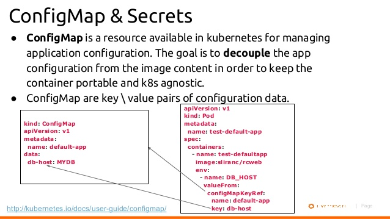

# Secrect

Nuestras aplicaciones en varias ocasiones necesita utilizar secretos, expongamos algunos ejemplos:

- Database credentials
- API credentials & endpoints
- Infraestructure API credentials (Google, AWS, Azure)
- Private (TLS) Keys (Mucho cuidado aquí)
- ect.

Yo lo incluyo en mi código, ¡Error!, todo tu codigo lo puseas al repositorio de código donde a menudo es público, por lo que estariamos comiteando keys/token de AWS que podría ver cualquier persona que pudiese acceder al código.

  - **PROS:**
    - Los secretos podrán ser montados en volumenes de persistencia o ser expuestos a través de variables de entorno que serán usadas por el contenedor alojado en el nuestro pod.
    - El secreto solo será enviado si el pod asi lo requiere.
    - Los secretos son guardados en el disco del nodo in tmpfs volumes.
    - La comunicación entre el api-server al kubelet que corre en el nodo es protegida por SSL/TLS.

  - **CONTRAS:**
    - En el API server el secreto es guardado en texto plano en etcd, para añadir una mayor seguridad haría que limitar el acceso a usuarios solo administradores.
    - No es posible definir un control de que usuarios de k8s puedes acceder al secret.
    - Es posible que se pueda subir sin querer el secreto a un repositorio de código.

  - **DETALLES:**
    - El secreto debe ser creado antes del pod ya que este depende del secreto si así se le especifica.
    - Los secretos tienen un tamaño máximo de 1MB.
    - Solo se pueden referenciar a los secretos de un mismo namespaces, no se pueden solicitar secretos correspondiente a otro namespace.
    - Una vez lanzado el pod dispone de un secreto, si este es cambiado será necesario su reinicio.
 
    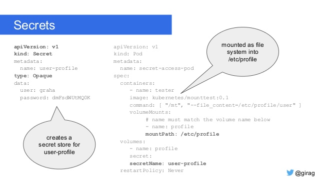
    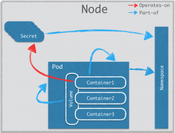

# Persistencia con Volumes

Kubernetes soporta multiples tipos de Volúmenes:  
Enlace de doc: <https://kubernetes.io/docs/concepts/storage/volumes/>

- **emptyDir:** Este tipo de volumen es creado cuando un pod es asignado a un nodo, y existirá tanto tiempo como el mismo pod. Inicialmente este volumen esta vacío y permite a contenedores compartir ficheros. Todos estos puede leer y escribir del volumen. El punto de montaje puede diferir en los contenedores que usan este volumen. Con este tipo de volumen es posible usar como dispositivo de almacenamiento la memoria. Sí usamos la propiedad emptyDir.medium con valor Memory este se montará usando tmpfs (RAM filesystem). Este tipo de sistema de almacenamiento es bastante rápido pero: 1) consume memoria de la maquina; y 2) no mantiene la información.
- **hostPath:** Nada recomendable ya que se añade la persistencia en el hosts que este aloja.
- **gcePersistentDisk:**
- **awsElasticBlockStore:** Este tipo de volúmenes usan el sistema EBS de AWS. Los volúmenes tienen que estar en instancias de tipo AWS, en la misma región y availability zone para poder ser utilizados entre contenedores. Solo un contenedor puede ser montado en una maquina. EBS snapshots es una funcionalidad disponible en AWS volumes.
- **nfs:** nfs volumen permite montar un nfs share en un pod. A diferencia de emptyDir el cual es borrado una vez el pod es borrado. El contenido del volumen persiste y el volumen es simplemente desmontado, umount. Este tipo de volúmenes permite tener múltiple puntos de escritura, la información puede ser compartido entre pods múltiples.
- **iscsi:** Permite montar un volumen existente de tipo iSCSI. Este tipo persiste una vez que el pod es borrado y la información puede ser reutilizada. Una característica de iSCSI es que puede ser montado como solo lectura y accedido por múltiples consumidores simultáneamente. Sin embargo, este tipo solo permite tener un consumidor de tipo read-write, así que no hay varios escritores simultáneamente como ocurre con nfs.
- **fc (fibre channel):**
- **Flocker:** Proporciona una herramienta para gestionar y orquestar la gestión de nuestros volúmenes con soporte para diversos tipos de sistemas de almacenamiento. En otras palabras, ofrece un sistema agnóstico para la gestión de volúmenes en diferentes plataformas. Un volumen Flocker permite montar un dataset en un pod. Si este volumen no existe en Flocker control, se creará uno nuevo.
- **Glusterfs:** Un volumen glusterfs permite usar el sistem de ficheros en red de glusterfs. El contenido de este volumen permanece después de borrar el pod. Al igual que nfs, puede ser montado con múltiples escrituras accediendo simultáneamente.
- **rbd:** Es un volumen para Rados Block Device que puede ser montado en tus pods. Al igual que la mayoría, la información persiste incluso después de borrar el pod. Como iSCSI, solo puede haber un consumidor con derecho a lectura mientras que no hay limite con consumidores de tipo lectura.
- **cephfs:**
- **gitRepo:** Es un ejemplo de lo que se puede conseguir con un plugin para volúmenes. Este monta un directorio vacio y clona un repositorio git en el pod para su uso. En el
futuro, este tipo de volúmenes deberán ser más independientes y no depender de la API de kubernetes.
- **Secret:** Es un volumen que se utiliza para compartir credenciales en un pod. A través de la API de kubernetes podemos almacenar credenciales que luego pueden montarse como volúmenes en los pods. Los volúmenes de tipo secret usan tmpfs (RAM filesystem) por lo que nunca son almacenados en discos persistentes.
- **persistentVolumeClaim:**
- **downwardAPI:** Este volumen se usa para hacer accesible información downward API a las aplicaciones. Este monta un directorio y escribe las peticiones en forma de ficheros de texto.
- **projected:**
- **azureFileVolume:**
- **azureDisk:**
- **vsphereVolume:**
- **Quobyte:**
- **PortworxVolume:**
- **ScaleIO:**
- **StorageOS:**
- **local:**

# Autoscaling NODES

Requisitos: [Instalar Heapster](#monitorizacion-con-heapster-with-an-influxdb-backend-and-a-grafana-ui)

Antes de añadir el add-ons de autoescaler, necesitaremos primero ajustar nuestra configuración nuestro grupo de instancias con Kops, para definir un minimo y maxio de nodos de autoescalado en AWS.

    kops edit ig nodes

Cambiamos el valor de maxSize: de 2 a 5 (En minSize: dejaremos 3):

    maxSize: 5
    minSize: 3

Guardamos el fichero y actualizamos la configuración del cluster:

    kops update cluster ${CLUSTER_FULL_NAME} --yes

Esto actualizará el grupo de auto-scaling en AWS.

Ahora necesitaremos crear un nuevo AWS IAM P    olicy para que el cluster pueda realizar los cambios sobre el grupo de autoescalado de AWS para nuestros nodos.

    aws iam put-role-policy --role-name nodes.${CLUSTER_FULL_NAME} \
        --policy-name asg-nodes.${CLUSTER_FULL_NAME} \
        --policy-document file://scripts/addons/cluster-autoscaler/policy-cluster-autoscaler.json

Actualizamos el manificesto del add-on del Cluster, con el mínimo de (3) y el máximo de (5):

    export MIN_NODES="3"
    export MAX_NODES="5"
    sed -i -e "s|--nodes=.*|--nodes=${MIN_NODES}:${MAX_NODES}:nodes.${CLUSTER_FULL_NAME}|g" \
        ./kubernetes/cluster-autoscaler/cluster-autoscaler-deploy.yaml
    sed -i -e "s|value: .*|value: ${CLUSTER_AWS_REGION}|g" \
        ./kubernetes/cluster-autoscaler/cluster-autoscaler-deploy.yaml

Ahora ya podremos desplecar el add-on en nuestro cluster:

    kubectl apply -f ./kubernetes/cluster-autoscaler
    deployment "cluster-autoscaler" created

Para confirmar que el pod de Autoscaler está corriendo con normalidad, lanzaremos el siguiente comando especificando el namespace de kube-system:

    kubectl get pods --namespace=kube-system
    NAME                                                    READY     STATUS    RESTARTS   AGE
    cluster-autoscaler-2966300785-74mcc                     1/1       Running   0          10s
    ...

# Autoscaling POD'S

Requisitos: [Instalar Heapster](#monitorizacion-con-heapster-with-an-influxdb-backend-and-a-grafana-ui)

Con "Horizontal Pod Autoscaling", Kubernetes automáticamente escala el numero de pods, dependiendo del uso de CPU (o cualquier otra métrica de las soportadas) que hayamos definido en nuestro Deployment. Este escalado no está soportado para los de tipo DaemonSet.

Es soportado por kubectl command para crear y visualizar nuestros "HPA", pongamos unos ejemplos

**Desplegar una demo de un sitio con HPA**

Crear un autoescalado para nuestra aplicación.

    kubectl run php-apache --image=gcr.io/google_containers/hpa-example \
        --requests=cpu=200m --expose --port=80

    kubectl autoscale deployment php-apache --cpu-percent=5 --min=2 --max=20

Visualizar nuestros hpa

    kubectl get hpa

    NAME         REFERENCE               TARGETS   MINPODS   MAXPODS   REPLICAS   AGE
    php-apache   Deployment/php-apache   0% / 5%   2         20        2          1m

**Generamos tráfico para probar nuesto HPA**

    kubectl run -i --tty load-generator --image=busybox /bin/sh

    # Hit enter for command prompt
    while true; do wget -q -O- http://php-apache.default.svc.cluster.local; done

    OK!OK!OK!OK!OK!OK!OK!OK!OK!OK!OK!OK!OK!OK!OK!OK!OK!OK!OK!OK!OK!OK!OK!OK!OK!OK!OK!
    OK!OK!OK!OK!OK!OK!OK!OK!OK!OK!OK!OK!OK!OK!OK!OK!OK!OK!OK!OK!OK!OK!OK!OK!OK!OK!OK!

Verificamos que el HAP que hemos creado esté autoescalando nuestra aplicación

    kubectl get hpa php-apache

    NAME         REFERENCE               TARGETS     MINPODS   MAXPODS   REPLICAS   AGE
    php-apache   Deployment/php-apache   242% / 5%   2         20        4          5m

Pasados unos minutos veremos que los pods siguen creciendo hasta un limite de 20

    kubectl get hpa php-apache

    NAME         REFERENCE               TARGETS    MINPODS   MAXPODS   REPLICAS   AGE
    php-apache   Deployment/php-apache   28% / 5%   2         20        16         18m

Ver en detalle uno de nuestros hpa

    kubectl describe hpa php-apache

Borrar uno de nuestros hpa

    kubectl delete hpa php-apache

# -KUBERNETES PRODUCTIVO-

Disponemos de varias opciones para instalar en la nube nuestro cluster de kubernetes, en el siguiente enlace podremos visualizar un listado de ellas para montarlo en la Cloud:  
https://kubernetes.io/docs/setup/pick-right-solution/#table-of-solutions

**Requisitos Mínimos del Clúster:**

Tamaño para el Servidor Maestro y componentes maestros.
Si usas una herramienta como kops, kube-up, para desplegar en GCE/GKE y AWS, te configurará las VM de tu master dependiendo del numero de nodos vayamos a tener en nuestro cluster. En otros proveedores habrá que realizarlo manualmente

Esta es la siguiente recomendación si lo montamos para AWS:

    1-5 nodes: m3.medium
    6-10 nodes: m3.large
    11-100 nodes: m3.xlarge

## Deploy Kubernetes con Kops (AWS)

Vamos a desplegar un cluster de kubernetes en AWS usando Kops, el comando para desplegar un cluster totalmente productivo en AWS. En nuestra primera prueba crearemos un cluster localizado en una única zona de disponibilidad compuestos por un master y dos nodos. Si quesieramos montarlo en HA con multiples masters y en diferentes zonas de disponibilidad os mostraremos un ejemplo.

Kops nos va a crear los siguientes objetos en el entorno de AWS:

- EC2 instancias para los master y nodos
- VPC dedicada for the cluster
- Route 53 DNS record for API server access
- Security group to allow inbound access to the API server

**1. Kops "k8s.local" (Skipeando DNS)**

    #Configurar tus credenciales de AWS.
        
    export NAME=mycluster.k8s.local
    export KOPS_STATE_STORE=s3://${NAME}-state
    export CLUSTER_AWS_AZ="eu-west-1a"
    
    aws s3api create-bucket --bucket ${NAME}-state
    aws s3api put-bucket-versioning --bucket ${NAME}-state --versioning-configuration Status=Enabled

Crearemos nuestro cluster con Kops:

    kops create cluster \
        --name=${NAME} \
        --zones=${CLUSTER_AWS_AZ} \
        --master-size="t2.medium" \
        --node-size="t2.medium" \
        --node-count="2" \
        --ssh-public-key="~/.ssh/id_rsa.pub" \
        --kubernetes-version="1.7.6"

Borrar Cluster con Kops
    kops delete cluster --name ${NAME}
    kops delete cluster --name ${NAME} --yes

Enlace: <https://github.com/kubernetes/kops/blob/master/docs/aws.md>

**2. Desplegar delegando zona con Route53**
**Prerequisitos**
    
    #Configurar tus credenciales de AWS.

    # Tu nombre de dominio de AWS Route 53
    export DOMAIN_NAME="cluster.k8slinux.cf"
    # Alias para el cluster
    export CLUSTER_ALIAS="eu"
    # Full DNS name of you cluster
    export CLUSTER_FULL_NAME="${CLUSTER_ALIAS}.${DOMAIN_NAME}"
    # AWS Zona de disponibilidad donde crear el cluster
    export CLUSTER_AWS_AZ="eu-west-1a"

**Desplegar nuevo Cluster**

Primero vamos a crear un bucket de S3, donde kops usará para guardar toda la información de la configuración del cluster, si este primer paso falla lo creamos a mano desde el el ui de AWS.

    aws s3api create-bucket --bucket ${CLUSTER_FULL_NAME}-state

Versionamos el Bucket

    aws s3api put-bucket-versioning --bucket ${CLUSTER_FULL_NAME}-state --versioning-configuration Status=Enabled

Exportamos nuestra variable de nuestro bucket:

    export KOPS_STATE_STORE="s3://${CLUSTER_FULL_NAME}-state"

Crearemos nuestro cluster con Kops:

    kops create cluster \
        --name=${CLUSTER_FULL_NAME} \
        --zones=${CLUSTER_AWS_AZ} \
        --master-size="t2.medium" \
        --node-size="t2.medium" \
        --node-count="2" \
        --dns-zone=${DOMAIN_NAME} \
        --ssh-public-key="~/.ssh/id_rsa.pub" \
        --kubernetes-version="1.7.6"

Si se quisiera montar un cluster en alta disponibilidad con multiples master y en diferentes zonas de disponibilidad usaremos los siguientes parámetros a la hora de crear el cluster.

    --master-zones=us-east-1a,us-east-1b,us-east-1d
    --zones=us-east-1a,us-east-1b,us-east-1d
    --node-count=6

Ahora la configuración del cluster se ha creado y subido al bucket de S3, la cual podremos editar y volver a redesplegar el cluster:

    kops edit cluster ${CLUSTER_FULL_NAME}

Para aplicar los cambios y lanzar la creación del cluster en AWS:

    kops update cluster ${CLUSTER_FULL_NAME} --yes

Esto llevará aproximadamente unos **5 minutos** para tener el cluster totalmente activo. Mientras tanto vamos a crearnos un context alias en nuestro kubeconfig file, para que sea mas facil en el futuro moverse entre varios clusters de kubernetes.

    kubectl config set-context ${CLUSTER_ALIAS} --cluster=${CLUSTER_FULL_NAME} \
        --user=${CLUSTER_FULL_NAME}

Para visualizar todos los contexts creados:

    kubectl config get-contexts

Para utilizar el que hemos creado:

    kubectl config use-context ${CLUSTER_ALIAS}

**Comprobar el estado del cluster**

    kubectl cluster-info
    kubectl get nodes

**Automatic Upgrade del Cluster**  
Para un upgrade automático a la ultima version disponible, lanzaremos el siguiente comando para tener una previsualización.

    kops upgrade cluster ${CLUSTER_ALIAS}

Para aplicar el cambio:

    kops upgrade cluster ${CLUSTER_ALIAS} --yes

**Manual Upgrade del cluster**  

    kops edit cluster $NAME
    set the KubernetesVersion to the target version (e.g. v1.3.5)
    kops update cluster $NAME to preview, then kops update cluster $NAME --yes
    kops rolling-update cluster $NAME to preview, then kops rolling-update cluster $NAME --yes

**Deploy the Kubernetes dashboard**

Para desplegar la última versión del dashboard ejecutamos lo siguiente (Dependiendo de la version de nuestro kubernetes tendremos que cambiar a la api que apunta):

    kubectl apply -f https://raw.githubusercontent.com/kubernetes/dashboard/master/src/deploy/alternative/kubernetes-dashboard.yaml

La url cuando lo montemos con DNS:

    https://api.${CLUSTER_FULL_NAME}/ui/:
    echo "https://api.${CLUSTER_FULL_NAME}/ui/"

La url de nuestro cluster skipeando con dns

    kubectl proxy
    http://localhost:8001/api/v1/namespaces/kube-system/services/https:kubernetes-dashboard:/proxy/

Para acceder a nuestro dashboard a través de token:

    kubectl -n kube-system get secret

    kubectl -n kube-system describe secret replicaset-controller-token-kzpmc
        Name:		replicaset-controller-token-kzpmc
        Namespace:	kube-system
        Labels:		<none>
        Annotations:	kubernetes.io/service-account.name=replicaset-controller
                kubernetes.io/service-account.uid=d0d93741-96c5-11e7-8245-901b0e532516

        Type:	kubernetes.io/service-account-token

        Data
        ====
        ca.crt:		1025 bytes
        namespace:	11 bytes
        token: eyJhbGciOiJSUzI1NiIsInR5cCI6IkpXVCJ9.eyJpc3MiOiJrdWJlcm5ldGVzL3NlcnZpY2VhY2Nvd

**Delete the cluster y bucket**  

    kops delete cluster ${CLUSTER_FULL_NAME} --yes
    aws s3api delete-bucket --bucket ${CLUSTER_FULL_NAME}-state

## Autenticación con Google OpenID

Si instalamos un cluster de kubernetes el cual no esté en GKE (Google Contaier Engine), nos faltará la parte de autenticación, la cual se puede realizar con Google OpenID.

<https://cloud.google.com/community/tutorials/kubernetes-auth-openid-rbac>

Authentication is often that last thing you decide to implement right before you go to production and you realize the security audit is going to block your staging or more likely production deploy. Its that thing that everyone recognizes as extremely important yet never manages to factor into the prototype/poc. Its the piece of the pie that could literally break a entire project with a single security incident but we somehow manage to accept Basic Authentication as ‘good enough’.

Now I’m not going to tell you I’m any different. In fact, its quite the opposite. What’s worse is I’ve got little to no excuse. I worked at Ping Identity for crying out loud. After as many incidents as I’ve heard of happening without good security, you would think I’d learn my lesson by now. But no, I put it off for quite some time in Kubernetes, accepting Basic Authentication to secure our future. That is, until now.

Caveat: There is a fair amount of complexity so if you find I’ve missed something important. PLEASE let me know in the comments so others can benefit.

Currently there are 4 Authentication methods that can be used in Kubernetes. Notice I did NOT say Authorization methods. Here is a very quick summary.

- Client Certificate Authentication – Fairly static even though multiple certificate authorities can be used. This would require a new client cert to be generated per user.
- Token File Authentication – Static in nature. Tokens all stored in a file on the host. No TTL. List of Tokens can only be changed by modifying the file and restarting the api server.
- Basic Authentication – Need I say more? very similar to htpasswd.
- OpenID Connect Authentication – The only solution with the possibility of being SSO based and allowing for dynamic user management.

Authentication within Kubernetes is still very much in its infancy and there is a ton to do in this space but with OpenID Connect, we can create an acceptable solution with other OpenSource tools.

One of those solutions is a combination of mod_auth_openidc and Keycloak.

mod_auth_openidc – an authentication/authorization module for Apache 2.x created by Ping Identity.

Keycloak – Integrated SSO and IDM for browser apps and RESTful web services.

Now to be clear, if you were to be running OpenShift (RedHat’s spin on Kubernetes), this process would be a bit simpler as Keycloak was recently acquired by Red Hat and they have placed a lot of effort into integrating the two.

## Monitorizacion con Heapster with an InfluxDB backend and a Grafana UI
 
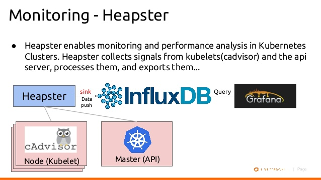
Enlace: <https://github.com/kubernetes/heapster/blob/master/docs/influxdb.md>

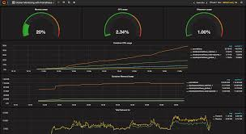

**Instalar Heapster**

https://github.com/kubernetes/heapster.git

    git clone https://github.com/kubernetes/heapster.git

https://github.com/kubernetes/heapster/blob/master/docs/influxdb.md
    
    
    kubectl create -f deploy/kube-config/influxdb/
    kubectl create -f deploy/kube-config/rbac/heapster-rbac.yaml

    # Forwarding desde contenedor    
    kubectl port-forward grafana-core 3000

    # Entraremos desde localhost al puerto 9090. Usuario y contraseña por defecto admin/admin
    http://localhost:3000

**Monitorización de logs de tus aplicaciones con Fluentd, elasticsearch y Kibana.**

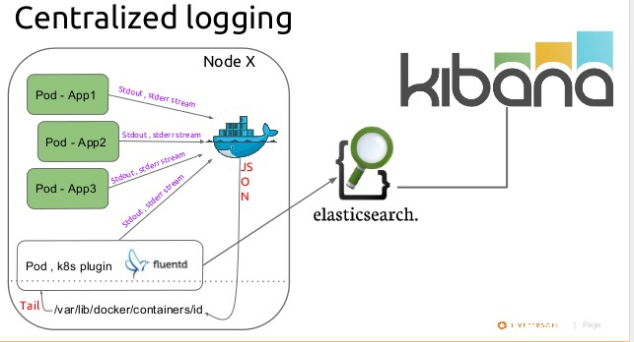

**NOTA: Configurada nuestra VPN dentro del cluster, atacaremos a través de la IP de servicio.**

## Exponer K8s a través de VPN

Enlaces: 
- <http://www.nqbao.com/blog/2017/02/exposing-kubernetes-cluster-over-vpn/>
- <http://rafabene.com/2015/11/11/how-expose-kubernetes-services/>
- <https://github.com/pieterlange/kube-openvpn>

Tras haber montado nuestro cluster, una de las cosas con las que nos podemos encontrar es que no se puede tener acceso a los pods o servicios directamente, se debe de usar kubectl pod forwarding, pero esto realmente es un inconveniente. Para ello lo haremos acesible a través de VPN, una vez conectado a ella podremos llegar correctamente a la VPC del cluster de Kubernetes.

Existe una forma fácil de configurar una VPN dentro del clúster de kubernetes, y luego esxponer esa VPN a través de NodePort. Pero tomaremos el camino dificil sobre todo porque esto nos ayudará a entender más sobre las redes de Kubernetes. Deberemos seguir tres puntos:

A continuación podremos ver un esquema de como quedaría:  

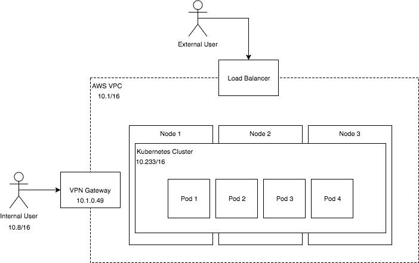

NOTA: Como anotación en nuestro kubernetes estamos usando Flannel network addon y para el servidor de VPN usaremos Openvpn. 

## Mantenimiento del cluster

**Mantenimiento de un Nodo:**

Si se necesita reiniciar un nodo (tras el upgrade de kernel, reparación del hardware, ect) nos encontraremos con dos casos:
- Tiempo de inactividad es breve (menor a 5 minutos), luego cuando se reinicie Kubelet, intentará reiniciar los pods que estaban programados en él.

- Tiempo de inactividad es largo, mayor a 5 minutos por defecto el cual es controlado por el crontoller-manager se puede modificar con el siguiente parámetro --pod-eviction-timeout. El node controller terminará los pods que están vinculados a dicho nodo no activo. Si tenemos definido un conjunto de réplicas, se iniciará una copia del pod en un nodo diferente.

Si se quiere disponer de mayor control sobre este proceso, podremos realizar el siguiente comando para pasar todo los contenedores a otros nodos:

    kubectl drain $NODENAME

Volveremos a poner el nodo activo

    kubectl uncordon NODENAME 

## Troubleshooting

This doc is about cluster troubleshooting; we assume you have already ruled out your application as the root cause of the problem you are experiencing. 
Enlace para mayor información: https://kubernetes.io/docs/tasks/debug-application-cluster/debug-cluster/

Listing your cluster. The first thing to debug in your cluster is if your nodes are all registered correctly.

    kubectl get nodes

And verify that all of the nodes you expect to see are present and that they are all in the Ready state.
Looking at logs

For now, digging deeper into the cluster requires logging into the relevant machines. Here are the locations of the relevant log files. (note that on systemd-based systems, you may need to use journalctl instead)

- **Master**
    - /var/log/kube-apiserver.log - API Server, responsible for serving the API
    - /var/log/kube-scheduler.log - Scheduler, responsible for making scheduling decisions
    - /var/log/kube-controller-manager.log - Controller that manages replication controllers
- **Worker Nodes**
    - /var/log/kubelet.log - Kubelet, responsible for running containers on the node
    - /var/log/kube-proxy.log - Kube Proxy, responsible for service load balancing

-----------------------------------------------------------------------------------------

  [1]: https://kubernetes.io/docs/concepts/workloads/controllers/replicaset/ "Replica Sets"
  [2]: https://kubernetes.io/docs/concepts/workloads/controllers/replicationcontroller/ "Replication Controller"
  [3]: https://kubernetes.io/docs/concepts/workloads/controllers/deployment/ "Deployments"
  [4]: https://kubernetes.io/docs/concepts/workloads/controllers/statefulset/ "StateFulSets"
  [5]: https://kubernetes.io/docs/concepts/workloads/controllers/daemonset/ "Daemon Sets"
  [6]: https://kubernetes.io/docs/concepts/workloads/controllers/garbage-collection/ "Garbage Collection"
  [7]: https://kubernetes.io/docs/concepts/workloads/controllers/jobs-run-to-completion/ "Job - Run to Completetion"
  [8]: https://kubernetes.io/docs/concepts/workloads/controllers/cron-jobs/ "Cron Jobs"
  [9]: https://kubernetes.io/docs/home/ "Kubernetes Docs"
  [10]: https://thenewstack.io/kubernetes-an-overview/ "Kubernetes Overview"
  [11]: https://kubernetes.io/docs/tutorials/ "Tutorials Kubernetes"
  [12]: https://github.com/Mirantis/kubeadm-dind-cluster "kubeadm-dind"

**Enlaces Utilizados:**

- [Kubernetes Docs][9]
- [Kubernetes Overview][10]

> Written by **Marcos Aranda**